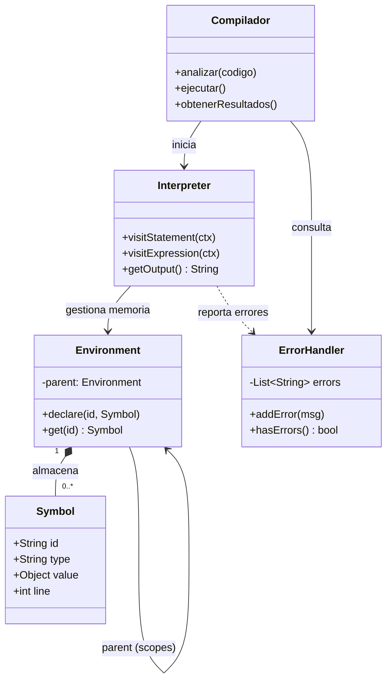
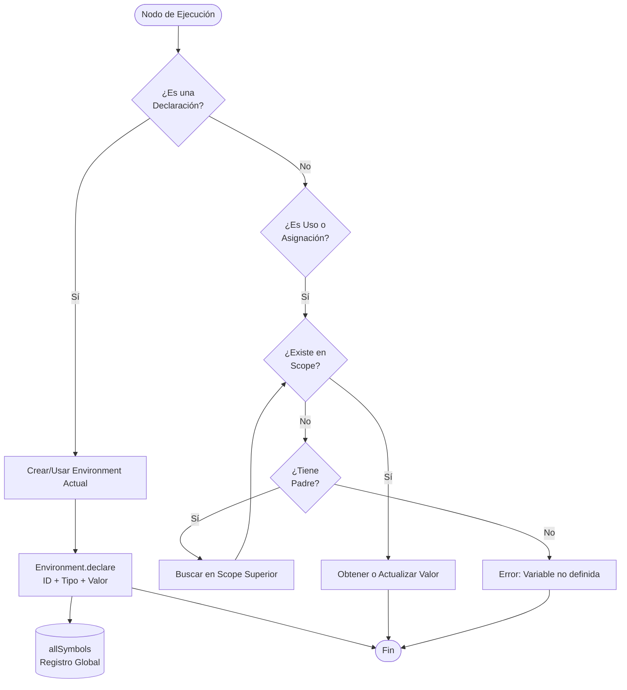

# Manual Técnico - Intérprete Golampi

**Universidad de San Carlos de Guatenala**

**Facultade de Ingeniería** 

**Organizacion de Lenguajes y Compiladores 2**

**Jorge Ivan Samayoa Sian - 202307506**

---

## 1. Grámatica formal de Golampi

### 1.1. Estructura del programa

```ebnf
start   ::= topDecl * EOF

topDecl ::= functionDecl
        | varDecl
        | constantDecl
```
### 1.2. Declaraciones

```ebnf
functionDecl  ::= 'func' ID '(' paramList? ')' returnTypes? block

returnTypes   ::= type
               | '(' type (',' type)* ')'

paramList     ::= parametro (',' parametro)*
parametro     ::= ID type

varDecl       ::= 'var' ID (',' ID)* type ('=' valores)?
constantDecl  ::= 'const' ID type '=' expression
shortDecl     ::= ID (',' ID)* ':=' valores
```
### 1.3. Bloque y sentencias

```ebnf
block         ::= '{' statement* '}'

statement     ::= varDecl ';'?
               | constantDecl ';'?
               | shortDecl ';'?
               | assignment ';'?
               | increment ';'?
               | printStmt ';'?
               | ifStmt ';'?
               | switchStmt ';'?
               | forStmt ';'?
               | breakStmt ';'?
               | continueStmt ';'?
               | block ';'?
               | returnStmt ';'?
               | arrayAssignment ';'?
               | expression ';'?
               | '*'+ ID '=' expression ';'?
               | ';'
```
### 1.4 Asignaciones y operadores de actualización

```ebnf
assignment    ::= ID (',' ID)* '=' valores
               | ID op=( '+=' | '-=' | '*=' | '/=' | '%=' ) expression

increment     ::= ID ( '++' | '--' )

arrayAssignment ::= ID ('[' expression ']')+ '=' expression
```

### 1.5 Sentencias de control de flujo

```ebnf
ifStmt        ::= 'if' expression block ( 'else' ( ifStmt | block ) )?

switchStmt    ::= 'switch' expression '{' switchBlock '}'
switchBlock   ::= caseStmt* defaultStmt?
caseStmt      ::= 'case' valores ':' statement*
defaultStmt   ::= 'default' ':' statement*

forStmt       ::= 'for' (
                    expression
                  | (varDecl | shortDecl) ';' expression ';' (assignment | increment)
                )? block

breakStmt     ::= 'break'
continueStmt  ::= 'continue'
returnStmt    ::= 'return' valores?
```

### 1.6 Salida estándar

```ebnf
printStmt     ::= ( 'print' | 'println' | 'fmt.Println' ) '(' valores? ')'
```

### 1.7 Expresiones

```ebnf
expression    ::= '(' expression ')'
               | '!' expression
               | '-' expression
               | arrayLiteral
               | '{' (valores ','?)? '}'
               | '&' ID
               | '*' expression
               | expression '[' expression ']'
               | expression '(' valores? ')'
               | expression ( '*' | '/' | '%' ) expression
               | expression ( '+' | '-' ) expression
               | expression ( '<' | '>' | '<=' | '>=' ) expression
               | expression ( '==' | '!=' ) expression
               | expression '&&' expression
               | expression '||' expression
               | ( 'len' | 'now' | 'substr' | 'typeOf' ) '(' valores? ')'
               | ID
               | literal

valores       ::= expression (',' expression)*
```

### 1.8 Tipos

```ebnf
type          ::= 'int32'
               | 'float32'
               | 'bool'
               | 'rune'
               | 'string'
               | '*' type
               | '[' expression ']' type
               | '[]' type
               | ID
```

### 1.9 Literales

```ebnf
literal       ::= ENTERO
               | DECIMAL
               | RUNE_LITERAL
               | STRING_LITERAL
               | BOOL_LIT
               | 'nil'

arrayLiteral  ::= type '{' (valores ','?)? '}'
```

### 1.10 Tokens léxicos

```ebnf
ID             ::= [a-zA-Z_][a-zA-Z_0-9]*
ENTERO         ::= [0-9]+
DECIMAL        ::= [0-9]+ '.' [0-9]+  |  '.' [0-9]+
STRING_LITERAL ::= '"' ( ~["\r\n\\] | '\\' . )* '"'
RUNE_LITERAL   ::= '\'' ( ~['\r\n\\] | '\\' . ) '\''
BOOL_LIT       ::= 'true' | 'false'

-- Comentarios (ignorados) --
COMMENT_SINGLE ::= '//' ~[\r\n]*
COMMENT_MULTI  ::= '/*' .*? '*/'
WS             ::= [ \t\r\n]+

-- Error léxico --
ERR_CHAR       ::= .     (* cualquier carácter no reconocido *)
```

---

## 2. Diagrama de clases


---

## 3. Flujo de Procesamiento



### 3.1. Descripcion del fljo

| Etapa | Componente | Acción |
|---|---|---|
| **Léxico** | `GolampiLexer` + `GolampiErrorCollector` | Tokeniza el fuente; caracteres no reconocidos (`ERR_CHAR`) generan error tipo *Léxico*. |
| **Sintáctico** | `GolampiParser` + `GolampiErrorCollector` | Construye el AST; errores estructurales generan error tipo *Sintáctico*. |
| **Hoisting** | `GolampiInterpreter::visitStart` | Recorre todos los `topDecl` buscando `functionDecl` y pre-declara cada función en el entorno global (`Environment::declare` con tipo `función`). |
| **Ejecución** | `GolampiInterpreter::callFunction("main")` | Localiza y ejecuta `main`. Cada llamada a función crea un nuevo `Environment` hijo. |
| **Declaración** | `Environment::declare` | Registra el símbolo en el scope actual y en `$allSymbols` (lista estática global). Lanza `GolampiRuntimeError` si el identificador ya existe en el mismo scope. |
| **Asignación** | `Environment::set` | Modifica el valor de una variable ya declarada, buscando en la cadena de scopes. No vuelve a registrar en `$allSymbols`. |
| **Control de flujo** | `ReturnSignal` / `BreakSignal` / `ContinueSignal` | Excepciones PHP capturadas internamente para implementar `return`, `break` y `continue` sin romper el visitor. |
| **Reporte** | `index.php` | Une los errores de `GolampiErrorCollector` + `GolampiInterpreter::getSemanticErrors()` y envía JSON con `output`, `errors` y `symbols` al frontend. |

---

## 4. Tecnologías utilizadas

| Tecnología | Versión recomendada | Uso |
|---|---|---|
| PHP | 8.1+ | Backend / intérprete |
| ANTLRv4 PHP Runtime | 1.0.x | Lexer y parser generados |
| HTML5 / CSS3 / JS  | — | Interfaz gráfica |
| ANTLRv4 (tool) | 4.13+ | Generación de gramática |
